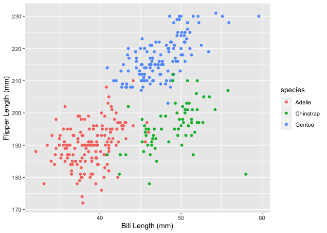

Homework 1
================
Alisha Sarakki (aps2204)

This is my solution to homework 1

``` r
library(tidyverse)
```

    ## ── Attaching packages ───────────────────────────────────────── tidyverse 1.3.0 ──

    ## ✓ ggplot2 3.3.2     ✓ purrr   0.3.4
    ## ✓ tibble  3.0.3     ✓ dplyr   1.0.2
    ## ✓ tidyr   1.1.2     ✓ stringr 1.4.0
    ## ✓ readr   1.3.1     ✓ forcats 0.5.0

    ## ── Conflicts ──────────────────────────────────────────── tidyverse_conflicts() ──
    ## x dplyr::filter() masks stats::filter()
    ## x dplyr::lag()    masks stats::lag()

## problem 1

Create a dataframe with the specified elements

``` r
prob1_df = 
  tibble(
    samp = rnorm(10),
    samp_gt_0 = samp > 0,
    char_vec = c("a","b","c","d","e","f","g","h","i","j"),
    factor_vec = factor(c("low","low","low","mod","mod","mod","mod","high","high","high"))
  )
```

Take the mean of each variable in my data frame

``` r
prob1_df = 
  tibble(
    samp = rnorm(10),
    samp_gt_0 = samp > 0,
    char_vec = c("a","b","c","d","e","f","g","h","i","j"),
    factor_vec = factor(c("low","low","low","mod","mod","mod","mod","high","high","high"))
  )
mean(pull(prob1_df , samp))
```

    ## [1] 0.05112326

``` r
mean(pull(prob1_df , samp_gt_0))
```

    ## [1] 0.5

``` r
mean(pull(prob1_df , char_vec))
```

    ## Warning in mean.default(pull(prob1_df, char_vec)): argument is not numeric or
    ## logical: returning NA

    ## [1] NA

``` r
mean(pull(prob1_df , factor_vec))
```

    ## Warning in mean.default(pull(prob1_df, factor_vec)): argument is not numeric or
    ## logical: returning NA

    ## [1] NA

I can take the mean of numbers and logical but not character or factor

``` r
as.numeric(pull(prob1_df, samp_gt_0)) * pull(prob1_df, samp)
```

    ##  [1] 1.2858783 0.1803521 0.0000000 0.0000000 0.2856507 0.0000000 0.0000000
    ##  [8] 0.7115840 0.0000000 0.2055243

## problem 2

# describe the penguins data set

First, installed the penguins data set and then used the
summary(penguins) function to give me an overview of the data/describe
it. The summary function told me about the size of the dataset,
important names and variables, and the mean flipper length and mean
flipper depth, among other things. A more detailed description answering
the question is listed below.

``` r
data("penguins", package = "palmerpenguins")
summary(penguins)
```

    ##       species          island    bill_length_mm  bill_depth_mm  
    ##  Adelie   :152   Biscoe   :168   Min.   :32.10   Min.   :13.10  
    ##  Chinstrap: 68   Dream    :124   1st Qu.:39.23   1st Qu.:15.60  
    ##  Gentoo   :124   Torgersen: 52   Median :44.45   Median :17.30  
    ##                                  Mean   :43.92   Mean   :17.15  
    ##                                  3rd Qu.:48.50   3rd Qu.:18.70  
    ##                                  Max.   :59.60   Max.   :21.50  
    ##                                  NA's   :2       NA's   :2      
    ##  flipper_length_mm  body_mass_g       sex           year     
    ##  Min.   :172.0     Min.   :2700   female:165   Min.   :2007  
    ##  1st Qu.:190.0     1st Qu.:3550   male  :168   1st Qu.:2007  
    ##  Median :197.0     Median :4050   NA's  : 11   Median :2008  
    ##  Mean   :200.9     Mean   :4202                Mean   :2008  
    ##  3rd Qu.:213.0     3rd Qu.:4750                3rd Qu.:2009  
    ##  Max.   :231.0     Max.   :6300                Max.   :2009  
    ##  NA's   :2         NA's   :2

This data describes a sample of 344 penguins taken from the islands of
the Palmer Archipelago in Antarctica. Important variables in this data
set include penguin species(Adelie, Chinstrap, and Gentoo), island
location(Biscoe, Dream, Torgersen), bill length(mean length of 43.92mm),
bill depth(mean depth of 17.15mm), flipper length(mean length of
200.9mm), and body mass (mean mass of 4202g). Additional important
descriptive information includes the sex of the penguins sampled (165
female, 168 male), and the years in which the study took place
(2007-2009).

``` r
nrow(penguins)
```

    ## [1] 344

``` r
ncol(penguins)
```

    ## [1] 8

This dataset contains 344 rows and 8 columns. The mean flipper length is
200.9mm.

Below is the plot of bill length(mm) vs. flipper length(mm) of all three
species of sampled penguins. Each color represents a different species,
as specified by the plot. My code defines the data, variables, and the
way I distribute the color format. It also defines the type of plot I
want, as well as the x and y axes.

penguins\_plot was used to visually display the code.

``` r
penguins_plot =  ggplot(data = penguins, aes(x = bill_length_mm, y = flipper_length_mm, color = species)) + geom_point() + xlab("Bill Length (mm)") + ylab("Flipper Length (mm)")

penguins_plot
```

    ## Warning: Removed 2 rows containing missing values (geom_point).

<!-- -->
Below, I use ggsave to save the plot to my project directory.

``` r
ggsave
```

    ## function (filename, plot = last_plot(), device = NULL, path = NULL, 
    ##     scale = 1, width = NA, height = NA, units = c("in", "cm", 
    ##         "mm"), dpi = 300, limitsize = TRUE, ...) 
    ## {
    ##     dpi <- parse_dpi(dpi)
    ##     dev <- plot_dev(device, filename, dpi = dpi)
    ##     dim <- plot_dim(c(width, height), scale = scale, units = units, 
    ##         limitsize = limitsize)
    ##     if (!is.null(path)) {
    ##         filename <- file.path(path, filename)
    ##     }
    ##     old_dev <- grDevices::dev.cur()
    ##     dev(filename = filename, width = dim[1], height = dim[2], 
    ##         ...)
    ##     on.exit(utils::capture.output({
    ##         grDevices::dev.off()
    ##         if (old_dev > 1) grDevices::dev.set(old_dev)
    ##     }))
    ##     grid.draw(plot)
    ##     invisible()
    ## }
    ## <bytecode: 0x7ff67bf56858>
    ## <environment: namespace:ggplot2>
